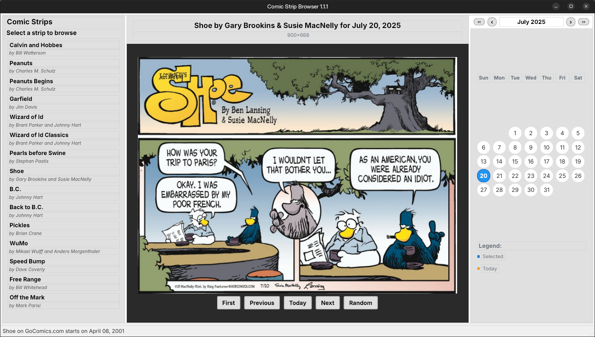

# Comic Strip Browser

A standalone PyQt6 application for browsing a selection of comic strips from GoComics.com. Features include calendar navigation, caching, and support for 15 popular comic strips including Calvin and Hobbes, Peanuts, Garfield, and more.

This app has been **vibe-coded with Amazon's Kiro** and adjusted afterwards. Read **[the full story](https://ludditus.com/2025/07/25/the-magic-of-amazons-kiro/)**.

## Features

- **15 Popular Comic Strips**: Calvin and Hobbes, Peanuts, Garfield, Wizard of Id, and more
- **Calendar Navigation**: Easy date selection with visual indicators
- **Keyboard Navigation**: `Left/Right/Top/Down Arrow` navigate in the active month when the calendar has focus
- **Smart Caching**: Stores last 50 comics per strip for fast loading
- **Offline Viewing**: View cached comics without internet connection
- **Error Recovery**: Automatic fallback when comics are unavailable
- **Cross-Platform**: Works on Linux and Windows\* (\*currently unavailable)

## Supported Comic Strips

1. **Calvin and Hobbes** - since 2007-01-01 (GoComics availability, not original publication)
2. **Peanuts** - since 1951-01-01 (Good historical coverage)
3. **Peanuts Begins** - since 2021-04-15 (Recent reprint series)
4. **Garfield** - since 1979-01-01 (Good historical coverage)
5. **Wizard of Id** - since 2003-01-01 (Limited GoComics availability)
6. **Wizard of Id Classics** - since 2015-01-01 (Classics reprint series)
7. **Pearls before Swine** - since 2002-01-07 (Close to original start date)
8. **Shoe** - since 2001-04-08 (Limited GoComics availability)
9. **B.C.** - since 2003-01-01 (Limited GoComics availability)
10. **Back to B.C.** - since 2016-01-01 (Recent reprint series)
11. **Pickles** - since 2003-01-01 (Limited GoComics availability)
12. **WuMo** - since 2014-01-01 (Relatively recent addition)
13. **Speed Bump** - since 2003-01-01 (Limited GoComics availability)
14. **Free Range** - since 2008-01-01 (Limited GoComics availability)
15. **Off the Mark** - since 2002-09-02 (Limited GoComics availability)



<p align="center">Under Ubuntu MATE 24.04 LTS (dark theme)</p>

## Releases

📦 **Binaries** can be downloaded from SourceForge: **[Comic Strip Browser Files](https://sourceforge.net/projects/comic-strip-browser/files/releases/)**.

## Installation

### Pre-built Binaries

- **Linux**: 
	- `.deb` package for Debian/Ubuntu/Mint
	- Prebuilt binary with `.desktop` file and icon
	- AppImage (just in case)

### Linux Installation

#### Using the .deb package (Debian/Ubuntu):
```bash
sudo apt install ./comic-strip-browser*.deb
```

Alternatively, GDebi, Captain (Mint) or Discover can be used.

#### Using the prebuilt binary:

With `comic-strip-browser`, `comic-strip-browser.desktop`, `comic-strip-browser.png` and `install.sh` in the same folder, make sure the last one is executable (`chmod +x install.sh`) and launch it. It will install to `~/.local/bin/`.

To uninstall the app, launch `~/.local/bin/uninstall-comic-strip-browser`.

### Using the AppImage:
```bash
chmod +x Comic_Strip_Browser-x86_64.AppImage
./Comic_Strip_Browser-x86_64.AppImage
```

## Building from Source

### Prerequisites:
```bash
# For Debian/Ubuntu/Mint
sudo apt-get update
sudo apt-get install -y build-essential python3 python3-pip

# For Fedora
sudo dnf install -y @development-tools python3 python3-pip

# For Arch Linux
sudo pacman -S base-devel python python-pip
```

### Build the binary:
```bash
./build_scripts/build_linux.sh
```

Alternatively:
```bash
python3 -m venv venv
source venv/bin/activate
pip install -r requirements.txt
python ./build_scripts/build.py
```

### Build the .deb:

After you have a successfully built binary:
```bash
python ./build_scripts/create_deb.py
```

### Build the AppImage:
```bash
curl -L -o appimagetool-x86_64.AppImage https://github.com/AppImage/appimagetool/releases/download/continuous/appimagetool-x86_64.AppImage
chmod +x appimagetool-x86_64.AppImage
./appimagetool-x86_64.AppImage dist/ComicStripBrowser.AppDir
```

### Windows:

Supposing you have a working Python installation:
```cmd
build_scripts\build_windows.bat
```

Note that I was not able to build a working Windows binary! See under **Known Issues** below.

## Known issues

### **Fractional scaling may lead to suboptimal rendering of the comics**

This is because such a scaling is performed externally, not by the app. Basically, an image is enlarged by the display server or by the window manager. While such a phenomenon is typically associated with X11, Deepin's Wayland-based Treeland is quite a failure in this regard. Compare the rendering in Deepin 25.0.1 with the out-of-the-box **125% desktop scaling** to the normal 100% scaling:

* [125% desktop scaling](./Screenshots/deepin_25_original_125_scaling.png)
* [100% desktop scaling](./Screenshots/deepin_25_reset_to_100_scaling.png)

Maximizing the window can help in some cases. In others, you might want to resize the window until a better rendering is obtained, if at all.

Otherwise, here's how the same comic strip looks by default in:

* [Linux Mint 22.1 Cinnamon](./Screenshots/Linux_Mint_22.1_Cinnamon.png)
* [Linux Mint 22.1 XFCE](./Screenshots/Linux_Mint_22.1_XFCE.png)
* [Ubuntu 25.04](./Screenshots/Ubuntu_25.04.png)
* [Kubuntu 25.10 snapshot2](./Screenshots/Kubuntu_25.10_snapshot2.png)

Note that the above screenshots were taken when the 15th comic title hadn't been added yet. 

### **Logging is enabled**

Disabling the logging created by Kiro is not trivial, so it was left in place. Unfortunately, it's not really useful even if you wanted to debug some unexpected issue.

### **Cached images and logs**

The last-accessed 50 images for each comic title are stored in a folder called `cache`, which is too generic a name.

The folders `cache` and `logs` are saved as follows:

* In the current directory when possible, which happens if you launch the binary or the AppImage from a folder somewhere in your home.
* In $HOME when this is not possible, especially when installed globally from the `.deb` and launched from the menu.
* Beware that if you launch the app via a launcher triggered by Alt+F2, the current directory is `~/Desktop` in MATE and $HOME in other desktop environments.

The location should have been `~/.cache/comic-strip-browser/` for the images and `~/.local/share/comic-strip-browser/logs/` for the logs, as per Kiro's produced documents.

### **GIF images detected as JPEG**

GIF images are erroneously identified as JPEG, and saved with the `*.jpg` extension in the disk cache. Most image readers would automatically detect the file type, but `eom` (Eye of MATE) will fail to open it: “Not a JPEG file: starts with 0x47 0x49”; should a WEBP be saved with the `.jpg` extension, `eom` will fail to open it as well.

### **Navigation in the past**

Although the oldest available date for each comic on GoComics.com title has been predetermined and it's hardcoded, the calendar doesn't prevent selecting a date that's unavailable. The original idea was to color in dark gray a date that's known to be unavailable, but during an automated bugfix by Kiro (Claude), this capability has been inadvertently removed.

### **Discover and AppStream**

I noticed that KDE Discover ignores the copyright file and claims there's no license in the `.deb`. Apparently, it expects all GUI packages to include AppStream metadata. I added such info in the `.deb`, but it's still ignored.

### **The AppImage**

The AppImage is, by all evidence, useless as long as it's basically a wrap around a fat binary created by PyInstaller. It doesn't hurt to have it, though.

### **Building under Windows**

Using the `.spec` file provided by Kiro, and the `requirements.txt`, building for Windows using PyInstaller either fails, or produces an EXE file that crashes. That's because PyInstaller isn't able to embed the required PyQt6 libraries. Should you be more knowledgeable about that, [drop me a line](mailto:ludditus@etik.com). Here's [a slightly longer story](https://ludditus.com/2025/07/25/the-magic-of-amazons-kiro/#6) of what I tried.

## License

This project is licensed under the MIT License. See LICENSE file for details.

**Note**: This application is for personal use only. Please respect the terms of service of GoComics.com and the copyright of comic strip creators.
