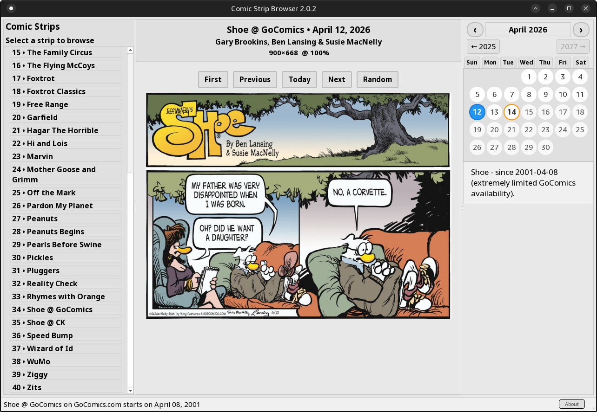

# Comic Strip Browser

A standalone PyQt6 application for browsing a selection of comic strips from GoComics and Comics Kingdom. Features include calendar navigation, caching, and support for 40 popular titles, including Calvin and Hobbes, Peanuts, Garfield, Shoe, Pearls Before Swine, Bizarro, and more.

This app has been vibe-coded with Amazon's Kiro and adjusted afterwards. Read **[the full story](https://ludditus.com/2025/07/25/the-magic-of-amazons-kiro/)**. That branch ended with version 1.0.4. Three months later, fixing a few bugs and adding a few features led to version 1.1.3.

**April 2026 saw a major overhauling of the app, culminating with the release of version 2.0.0.**

### Major changes
	
- **Comics Kingdom** is now supported in addition to **GoComics**.
- The number of comic titles increased from **20** to **40**.
- Builds are now made by GitHub.
- For the first time, **Windows** binaries are available!
- **Fractional desktop scaling** is better supported! (I still prefer 100%.)

### Good to know

- In addition to the **calendar navigation**, **keyboard navigation** is also possible for the currently selected comic title. Left/Right arrows: Previous/Next, Home/End: First/Today.
- **Disk caching** stores the last 200 comics per strip for fast loading or later consulting from the cache folder. The cached comics can be displayed by the app even without an internet connection.
- **GoComics** recently added a [Bunny Shield challenge](https://bunny.net/shield/) (read [here](https://ludditus.com/2026/03/28/the-day-gocomics-went-badcomics/) about what this broke) for requests coming from IPs that belong to some VPNs, data centers, or other shared IPs. **If you cannot see a comic hosted by GoComics, disconnect from your VPN or connect to a different server or country!** 
- Building from source is possible, but the automated builds by GitHub are better. For instance, my local builds made under Debian 13 resulted in OpenGL dependencies. GitHub's builds made under Ubuntu 24.04 don't have such dependencies.
- Post-1.1.3 versions benefited from the help of Qwen Code. A few tidbits have been inspired by suggestions made by Grok and Gemini. Since Qwen Code won't visibly search the internet for ideas, I occasionally asked Grok and Gemini in a browser for possible fixes (Qt6 is a mess, and Python doesn't help). They were all very keen to repeatedly break Qt6 layouts with their code, but I only took the good part from their vomit. Qwen Code's OAuth free tier (1,000 free requests/day) is extremely generous and can be fun to work with, as long as you keep the context below 20% full to avoid getting it confused and dumber (use `/compress` and, when it doesn't help, generate a `/summary` and start `/new`). It was Kimi who suggested I should use Qwen Code! Too bad that `/export` only saves the prompts and the answers *per se*, because Qwen Code's thinking can be fascinating, and the output of its attempts and explorations can also be quite instructive, yet they cannot be exported. Either way, paying to use Claude Code or Amazon Kiro is absurd when Qwen Code offers so much for free! (Of course, it will collect all your code and send it to Xi Jinping.)

### The list of supported comic strips

1. **Adam@Home** @ GoComics
2. **Andy Capp** @ GoComics
3. **B.C.** @ GoComics
4. **Back to B.C.** @ GoComics
5. **Beetle Bailey** @ CK
6. **Bizarro** @ CK
7. **Blondie** @ CK
8. **The Brilliant Mind Of Edison Lee** @ CK
9. **Calvin and Hobbes** @ GoComics
10. **Carpe Diem** @ CK
11. **Crock** @ CK
12. **Dennis The Menace** @ CK
13. **The Duplex** @ GoComics
14. **Dustin** @ CK
15. **The Family Circus** @ CK
16. **The Flying McCoys** @ GoComics
17. **Foxtrot** @ GoComics
18. **Foxtrot Classics** @ GoComics
19. **Free Range** @ GoComics
20. **Garfield** @ GoComics
21. **Hagar The Horrible** @ CK
22. **Hi and Lois** @ CK
23. **Marvin** @ CK
24. **Mother Goose and Grimm** @ GoComics
25. **Off the Mark** @ GoComics
26. **Pardon My Planet** @ CK
27. **Peanuts** @ GoComics
26. **Peanuts Begins** @ GoComics
29. **Pearls Before Swine** @ GoComics
30. **Pickles** @ GoComics
31. **Pluggers** @ CK
32. **Reality Check** @ GoComics
33. **Rhymes with Orange** @ CK
34. **Shoe** @ GoComics
35. **Shoe** @ CK
36. **Speed Bump** @ GoComics
37. **Wizard of Id** @ GoComics
38. **WuMo** @ GoComics
39. **Ziggy** @ GoComics
40. **Zits** @ CK

Note that some comic titles, especially in their early days, can have large gaps in availability.

### Releases

📦 **Pre-built binaries** are available on **[Releases](https://github.com/DerLudditus/comic-strip-browser/releases)**:

| Platform | Artifact |
|---|---|
| Linux binary | `comic-strip-browser` |
| Linux .deb | `comic-strip-browser_*_amd64.deb` (Debian/Ubuntu) |
| Linux .rpm | `comic-strip-browser-*.x86_64.rpm` (Fedora/RHEL) |
| Linux AppImage | `ComicStripBrowser-*.AppImage` |
| Windows | `ComicStripBrowser.exe` |

### Cached images
The last-accessed 200 images for each comic title are stored in a folder called `cache`, which is too generic a name. Each comic title has its own subfolder, though.

The folder `cache` is saved as follows:

* In the **current directory** whenever possible, which happens if you launch the binary or the AppImage from a folder somewhere in your home.
* In **$HOME** when this is not possible, especially when installed globally from `.deb` or `.rpm` and launched from the menu.
* Beware that if you launch the app via a launcher triggered by Alt+F2, the current directory is `~/Desktop` in MATE and $HOME in other desktop environments.

### License
This project is licensed under the MIT License. See LICENSE file for details.

**Note**: This application is for personal use only. Please respect the terms of service of GoComics.com, ComicsKingdom.com, and the copyright of comic strip creators.
