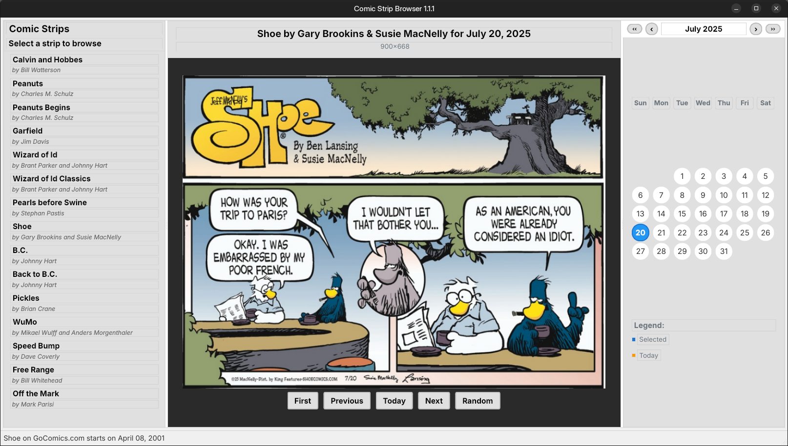

# Comic Strip Browser

A standalone PyQt6 application for browsing a selection of comic strips from GoComics.com. Features include calendar navigation, caching, and support for 20 popular comic strips including Calvin and Hobbes, Peanuts, Garfield, and more.

This app has been vibe-coded with Amazon's Kiro and adjusted afterwards. Read **[the full story](https://ludditus.com/2025/07/25/the-magic-of-amazons-kiro/)**. That branch ended with version 1.0.4.

Three months later, I tried to fix a few bugs and add some extra features. I still don't have a Windows build, but the Linux binaries and packages (`.deb`, `.rpm`) work rather fine in version 1.1.3.

Kiro (Claude) helped with these minor changes, but it added more bugs than it fixed. I should have hunted the bugs myself and only let Kiro create the RPM `.spec` and other boring stuff. Kiro is even able to be that stupid:

> Oops! I accidentally deleted the `.git` folder. Let me fix that:

Nothing beats Kiro in creating new bugs, though. Or in forgetting what the purpose of a change was, what was the bug we were hunting, or that the bug needs to be fixed, not the error message!

In the end, given the difficulties in building a PyQt6 self-contained Windows binary with either PyInstaller or cx_Freeze, I suppose PyQt6 is the wrong cross-platform framework. Maybe I should learn [Avalonia UI](https://docs.avaloniaui.net/docs/overview/what-is-avalonia).

## **NEW!** See also [**comic-strip-browser-web**](https://github.com/DerLudditus/comic-strip-browser-web) :rocket:

## Features

- **20 Popular Comic Strips**: Calvin and Hobbes, Peanuts, Garfield, Wizard of Id, and more.
- **Calendar Navigation**: Easy date selection with visual indicators.
- **Keyboard Navigation**: Left/Right arrows: Previous/Next, Home/End: First/Today.
- **Direct Access**: Button for First day of each comic as hosted on GoComics.com.
- **Random Access**: Button for display of a Random date for each comic.
- **Smart Caching**: Stores last 200 comics per strip for fast loading or later consulting from the cache folder.
- **Offline Viewing**: View cached comics without internet connection.
- **Cross-Platform**: Works on Linux and Windows.

## Supported Comic Strips

1. **Calvin and Hobbes** - since 1985-11-18
2. **Peanuts** - since 1950-10-16
3. **Peanuts Begins** - since 1950-10-16 (Reprint series; for old dates can be identical to Peanuts, only in color)
4. **Garfield** - since 1978-06-19
5. **Wizard of Id** - since 2002-01-01 (Limited GoComics availability)
6. **Pearls before Swine** - since 2002-01-07
7. **Shoe** - since 2001-04-08 (Limited GoComics availability)
8. **B.C.** - since 2002-01-01 (Limited GoComics availability)
9. **Back to B.C.** - since 2015-09-21 (Recent reprint series)
10. **Pickles** - since 2003-01-01 (Limited GoComics availability)
11. **WuMo** - since 2013-10-13 (With gaps)
12. **Speed Bump** - since 2002-01-01 (Limited GoComics availability)
13. **Free Range** - since 2007-02-03
14. **Off the Mark** - since 2002-09-02 (Limited GoComics availability)
15. **Mother Goose and Grimm** - since 2002-11-25 (Limited GoComics availability)
16. **The Flying McCoys** - since 2005-05-09
17. **The Duplex** - since 1996-08-12
18. **Reality Check** - since 1997-01-01
19. **Adam@Home** - since 1995-06-20
20. **Ziggy** - since 1971-06-27

Note that some comic titles, especially in their early days, can have large gaps in availability.



<p align="center">Version 1.1.1 under Ubuntu MATE 24.04 LTS (dark theme)</p>

## Releases

📦 **Pre-built binaries** are available on **[Releases](https://github.com/DerLudditus/comic-strip-browser/releases)**:

| Platform | Artifact |
|---|---|
| Linux binary | `comic-strip-browser` (onefile, ~70 MB) |
| Linux .deb | `comic-strip-browser_*.deb` (Debian/Ubuntu) |
| Linux .rpm | `comic-strip-browser-*.rpm` (Fedora/RHEL) |
| Linux AppImage | `ComicStripBrowser-*.AppImage` |
| Windows | `ComicStripBrowser-Windows.zip` (onedir) |

## Building from Source

### Prerequisites

```bash
# Python 3.12+
pip install PyQt6 requests beautifulsoup4 Pillow pyinstaller
```

### Build the onefile binary

```bash
./build_scripts/build_binary.sh
```
Output: `dist/onefile/comic-strip-browser`

### Build the .deb (Debian/Ubuntu only)

```bash
./build_scripts/build_deb.sh
```
Output: `dist/comic-strip-browser_*.deb`

### Build the .rpm (Fedora/RHEL only)

```bash
./build_scripts/build_rpm.sh
```
Output: `dist/comic-strip-browser-*.rpm`

### Build the AppImage

```bash
./build_scripts/build_appimage.sh
```
Output: `dist/comic-strip-browser-*.AppImage`

### Windows (PyInstaller onedir)

On a Windows machine with Python installed:

```cmd
pip install PyQt6 requests beautifulsoup4 Pillow pyinstaller
build_scripts\build_windows.bat
```
Output: `dist\ComicStripBrowser\` (directory with executable + DLLs)

### CI Builds

Every push to `main` and every tag triggers a GitHub Actions build for all platforms. Tag a release with `git tag v1.x.x && git push origin v1.x.x` to auto-create a GitHub Release with all artifacts.

## Known issues

### **Race conditions can make it forget the name of the selected comic strip**
Should you click around frantically, repeatedly changing the comic strip from the 15 provided options after having changed the date, you might at some point see error messages about the impossibility of retrieving the "unknown" comic for today, despite the selected day in the calendar being another one. In some cases clicking again on the desired title is useless, but other titles remain functional. Should this happen, close the app and reopen it. Shit happens.

### **Fractional scaling may lead to suboptimal rendering of the comics**
This is because such a scaling is performed externally, not by the app. Basically, an image is enlarged by the display server or by the window manager. While such a phenomenon is typically associated with X11, Deepin's Wayland-based Treeland is quite a failure in this regard. Compare the rendering in Deepin 25.0.1 with the out-of-the-box **125% desktop scaling** to the normal 100% scaling:

* [125% desktop scaling](./Screenshots/deepin_25_original_125_scaling.png)
* [100% desktop scaling](./Screenshots/deepin_25_reset_to_100_scaling.png)

Maximizing the window can help in some cases. In others, you might want to resize the window until a better rendering is obtained, if at all.

Otherwise, here's a selection of screenshots:

* MX 25: [one](./Screenshots/MX_25_1.png), [two](./Screenshots/MX_25_2.png)
* Lubuntu 25.10: [one](./Screenshots/Lubuntu_25.10_1.png), [two](./Screenshots/Lubuntu_25.10_2.png), [three](./Screenshots/Lubuntu_25.10_3.png)
* LMDE 7: [one](./Screenshots/LMDE7_1.png), [two](./Screenshots/LMDE7_2.png), [three](./Screenshots/LMDE7_3.png)
* Fedora 43 KDE (2025.10.15, KDE 6.4.5 on Wayland): [one](./Screenshots/FC43_KDE_1.png), [two](./Screenshots/FC43_KDE_2.png), [three](./Screenshots/FC43_KDE_3.png)

### **Cached images and logs**
The last-accessed 200 images for each comic title are stored in a folder called `cache`, which is too generic a name. Each comic title has its own subfolder, though.

The folder `cache` is saved as follows:

* In the current directory when possible, which happens if you launch the binary or the AppImage from a folder somewhere in your home.
* In $HOME when this is not possible, especially when installed globally from the `.deb` and launched from the menu.
* Beware that if you launch the app via a launcher triggered by Alt+F2, the current directory is `~/Desktop` in MATE and $HOME in other desktop environments.

The location should probably have been `~/.cache/comic-strip-browser/`.

### **Discover and AppStream**
I noticed that KDE Discover ignores the copyright file and claims there's no license in the `.deb`, or that the author is unknown in the `.rpm`. Bloody fucking Discover.

### **The AppImage**
The AppImage is, by all evidence, useless as long as it's basically a wrap around a fat binary created by PyInstaller. It doesn't hurt to have it, though.

## License
This project is licensed under the MIT License. See LICENSE file for details.

**Note**: This application is for personal use only. Please respect the terms of service of GoComics.com and the copyright of comic strip creators.
