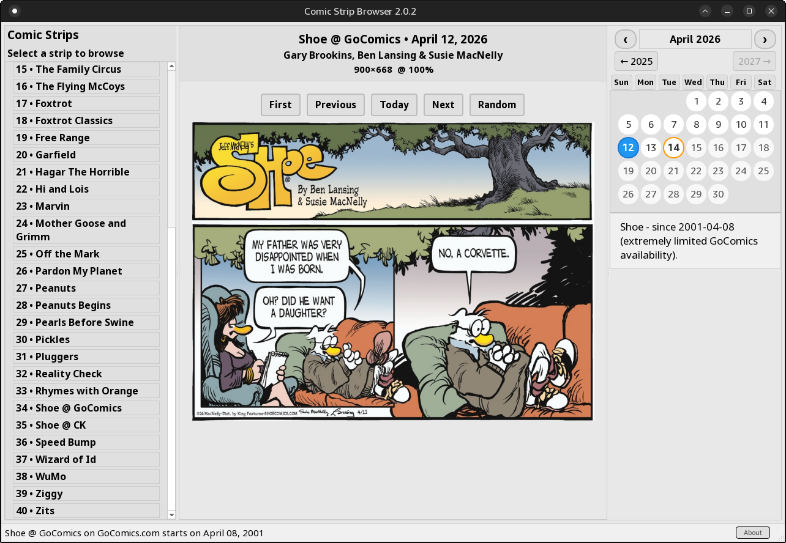

# Comic Strip Browser

A standalone PyQt6 application for browsing a selection of comic strips from GoComics and Comics Kingdom. Features include calendar navigation, caching, and support for **80 popular titles**, including Calvin and Hobbes, Peanuts, Garfield, Shoe, Pearls Before Swine, Bizarro, and more.

This app has been vibe-coded with Amazon's Kiro and adjusted afterwards. Read **[the full story](https://ludditus.com/2025/07/25/the-magic-of-amazons-kiro/)**. That branch ended with version 1.0.4. Three months later, fixing a few bugs and adding a few features led to version 1.1.3.

**April 2026 saw a major overhauling of the app, culminating with the release of version 2.0.0.**

**On July 31, Version 2.6.0 brought the number of titles from 62 to 80.**

### Major changes
	
- **Comics Kingdom** is now supported in addition to **GoComics**.
- The number of comic titles increased from **20** to **80** (4 of which are retrieved from both sites).
- Builds are now made by GitHub.
- For the first time, **Windows** binaries are available!
- **Fractional desktop scaling** is better supported! (I still prefer 100%.)

### Tested on: 

- MX 25 XFCE (Debian 13); 
- Ubuntu 26.04 LTS (only versions 2.0.0 to 2.4.0); 
- Kubuntu 26.04 LTS; 
- Ultramarine Linux 43 KDE Plasma Edition (only versions 2.0.0 to 2.4.0);
- Windows 11 IoT Enterprise LTSC 24H2 (26100.8037).

### Good to know

- In addition to the **calendar navigation**, **keyboard navigation** is also possible for the currently selected comic title. Left/Right arrows: Previous/Next, Home/End: First/Today.
- **Disk caching** stores the last 200 comics per strip for fast loading or later consulting from the cache folder. The cached comics can be displayed by the app even without an internet connection.
- **GoComics** recently added a [Bunny Shield challenge](https://bunny.net/shield/) (read [here](https://ludditus.com/2026/03/28/the-day-gocomics-went-badcomics/) about what this broke) for requests coming from IPs that belong to some VPNs, data centers, or other shared IPs. **If you cannot see a comic hosted by GoComics, disconnect from your VPN or connect to a different server or country!** 
- Building from source is possible, but the automated builds by GitHub are better. For instance, my local builds made under Debian 13 resulted in OpenGL dependencies. GitHub's builds made under Ubuntu 24.04 don't have such dependencies.
- Post-1.1.3 versions benefited from the help of Qwen Code. A few tidbits have been inspired by suggestions made by Grok and Gemini. Since Qwen Code won't visibly search the internet for ideas, I occasionally asked Grok and Gemini in a browser for possible fixes (Qt6 is a mess, and Python doesn't help). They were all very keen to repeatedly break Qt6 layouts with their code, but I only took the good part from their vomit. Qwen Code's OAuth free tier (1,000 free requests/day) is extremely generous and can be fun to work with, as long as you keep the context below 20% full to avoid getting it confused and dumber (use `/compress` and, when it doesn't help, generate a `/summary` and start `/new`). It was Kimi who suggested I should use Qwen Code! Too bad that `/export` only saves the prompts and the answers *per se*, because Qwen Code's thinking can be fascinating, and the output of its attempts and explorations can also be quite instructive, yet they cannot be exported. Either way, paying to use Claude Code or Amazon Kiro is absurd when Qwen Code offers so much for free! (Of course, it will collect all your code and send it to Xi Jinping.)

### The list of supported comic strips

1. **Adam@Home** @ GoComics
2. **Andy Capp** @ GoComics
3. **Animal Crackers** @ GoComics
4. **Animal Crackers** @ CK
5. **The Argyle Sweater** @ GoComics
6. **Aunty Acid** @ GoComics
7. **Baby Blues** @ GoComics
8. **Baldo** @ GoComics
9. **B.C.** @ GoComics
10. **Back to B.C.** @ GoComics
11. **Beetle Bailey** @ CK
12. **Bizarro** @ CK
13. **Bliss** @ GoComics
14. **Blondie** @ CK
15. **Brewster Rockit** @ GoComics
16. **The Brilliant Mind Of Edison Lee** @ CK
17. **Broom Hilda** @ GoComics
18. **Calvin and Hobbes** @ GoComics
19. **Carpe Diem** @ CK
20. **Crankshaft** @ GoComics
21. **Crock** @ CK
22. **Close to Home** @ GoComics
23. **Day by Dave** @ GoComics
24. **Dennis The Menace** @ CK
25. **Diamond Lil** @ GoComics
26. **Dick Tracy** @ GoComics
27. **Dick Tracy** @ CK
28. **Doonesbury** @ GoComics
29. **The Duplex** @ GoComics
30. **Dustin** @ CK
31. **The Family Circus** @ CK
32. **Flo and Friends** @ GoComics
33. **The Flying McCoys** @ GoComics
34. **Foxtrot** @ GoComics
35. **Foxtrot Classics** @ GoComics
36. **Frazz** @ GoComics
37. **Free Range** @ GoComics
38. **The Fusco Brothers** @ GoComics
39. **Garfield** @ GoComics
40. **Gasoline Alley** @ GoComics
41. **Ginger Meggs** @ GoComics
42. **Glasbergen Cartoons** @ GoComics
43. **Hagar The Horrible** @ CK
44. **Heart of the City** @ GoComics
45. **Hi and Lois** @ CK
46. **Judge Parker** @ CK
47. **The Lockhorns** @ GoComics
48. **Lola** @ GoComics
49. **Luann** @ GoComics
50. **Luann Againn** @ GoComics
51. **Mark Trail** @ CK
52. **Marmaduke** @ GoComics
53. **Marvin** @ CK
54. **Mary Worth** @ CK
55. **Moderately Confused** @ GoComics
56. **Mother Goose and Grimm** @ GoComics
57. **Mutts** @ CK
58. **Non Sequitur** @ GoComics
59. **Off the Mark** @ GoComics
60. **The Other Coast** @ GoComics
61. **Palurdeando** @ CK
62. **Pardon My Planet** @ CK
63. **Peanuts** @ GoComics
64. **Peanuts Begins** @ GoComics
65. **Pearls Before Swine** @ GoComics
66. **Pickles** @ GoComics
67. **Pluggers** @ GoComics
68. **Pluggers** @ CK
69. **Reality Check** @ GoComics
70. **Rex Morgan M.D.** @ CK
71. **Rhymes with Orange** @ CK
72. **Rip Haywire** @ GoComics
73. **Shoe** @ GoComics
74. **Shoe** @ CK
75. **Speed Bump** @ GoComics
76. **Tina’s Groove** @ GoComics
77. **Wizard of Id** @ GoComics
78. **WuMo** @ GoComics
79. **Ziggy** @ GoComics
80. **Zits** @ CK

Note that some comic titles, especially in their early days, can have large gaps in availability.

### Releases

📦 **Pre-built binaries** are available on **[Releases](https://github.com/DerLudditus/comic-strip-browser/releases)**:

| Platform | Artifact |
|---|---|
| Linux binary | `comic-strip-browser` |
| Linux .deb | `comic-strip-browser_*_amd64.deb` (Debian/Ubuntu) |
| Linux .rpm | `comic-strip-browser-*.x86_64.rpm` (Fedora/RHEL) |
| Linux AppImage | `ComicStripBrowser-*.AppImage` |
| Windows | `ComicStripBrowser.exe` |

### Cached images
The last-accessed 200 images for each comic title are stored in a folder called `cache`, which is too generic a name. Each comic title has its own subfolder, though.

The folder `cache` is saved as follows:

* In the **current directory** whenever possible, which happens if you launch the binary or the AppImage from a folder somewhere in your home.
* In **$HOME** when this is not possible, especially when installed globally from `.deb` or `.rpm` and launched from the menu.
* Beware that if you launch the app via a launcher triggered by Alt+F2, the current directory is `~/Desktop` in MATE and $HOME in other desktop environments.

### Hint

To run the application directly from the Python source code (`python3 main.py`), a couple of libraries are needed: `beautifulsoup4` and PIL. 

Under Debian or Ubuntu: 
`sudo apt install python3-bs4 python3-pil`

### License
This project is licensed under the MIT License. See LICENSE file for details.

**Note**: This application is for personal use only. Please respect the terms of service of GoComics.com, ComicsKingdom.com, and the copyright of comic strip creators.
