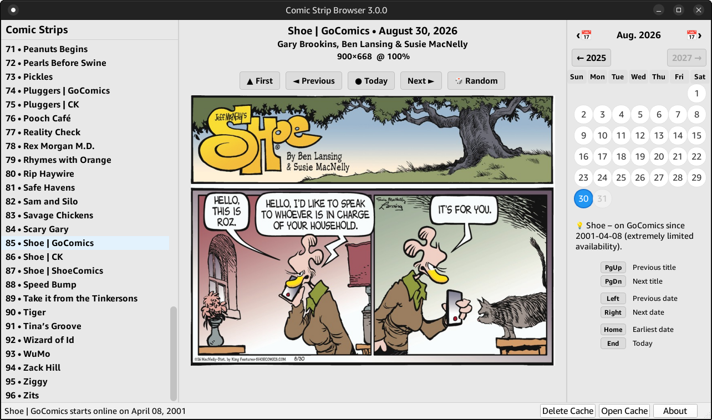
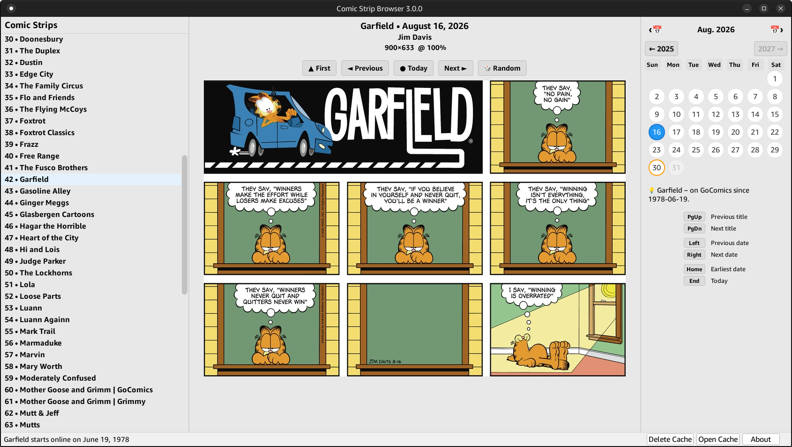
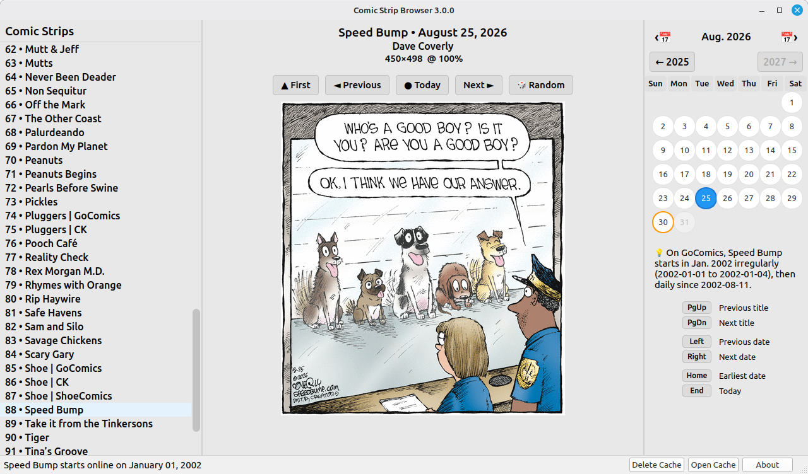
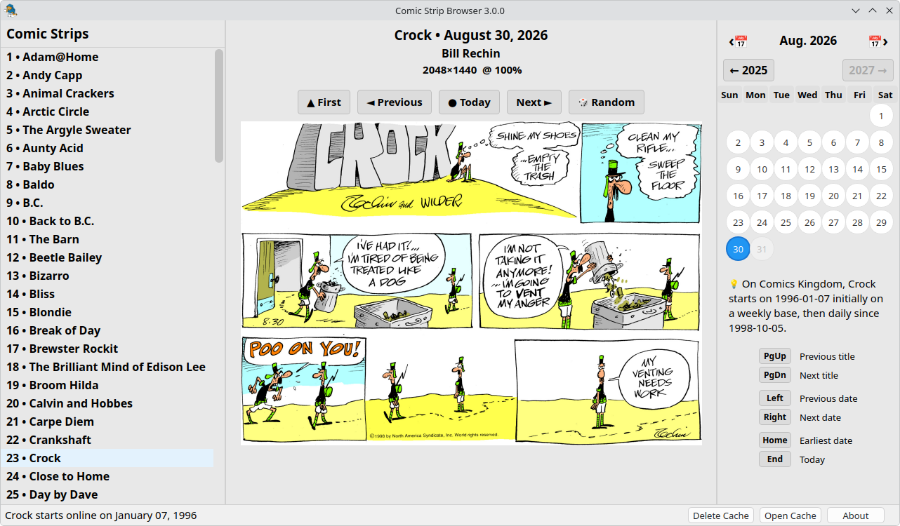
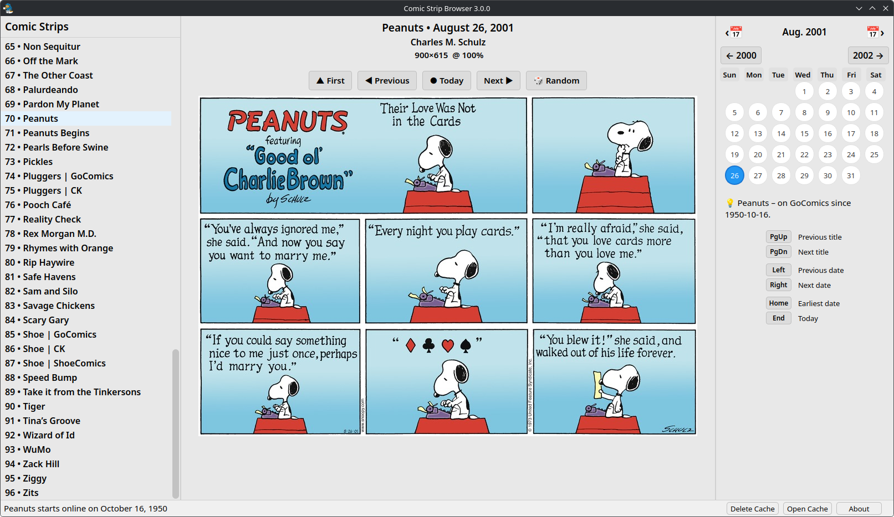
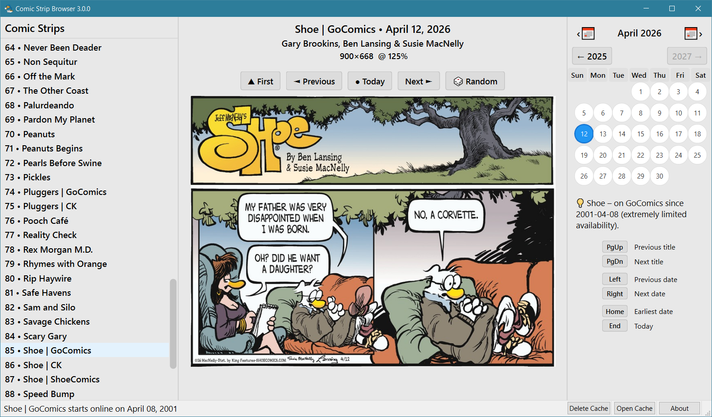
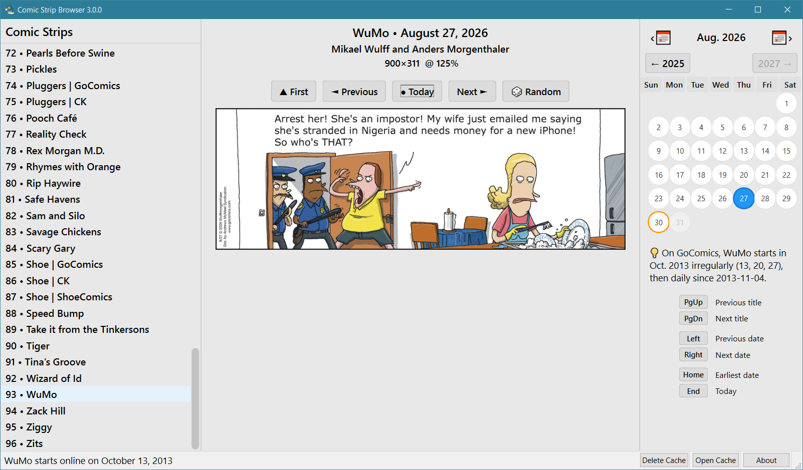
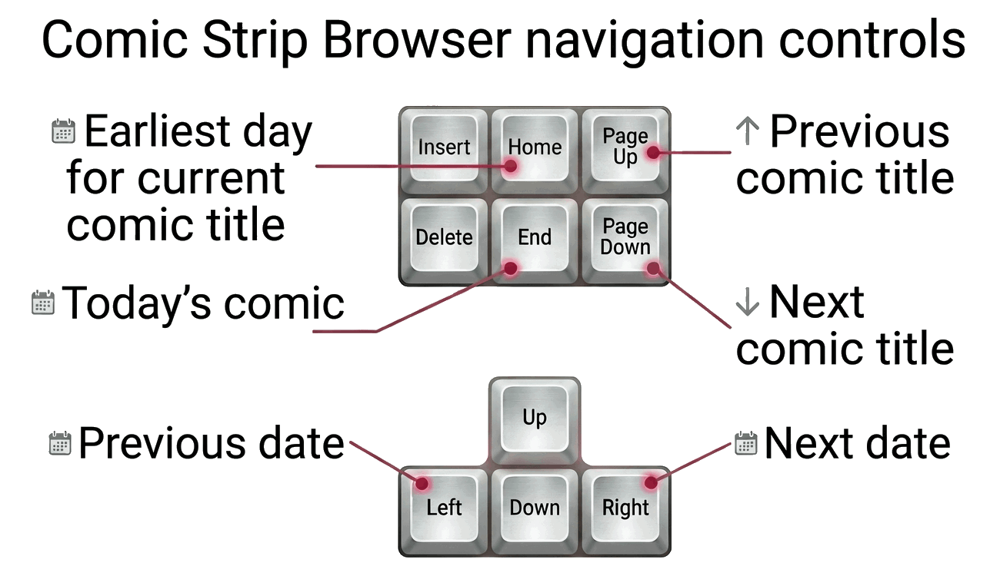

# Comic Strip Browser

A standalone PyQt6 application for browsing a selection of comic strips from GoComics and Comics Kingdom. Features include calendar navigation, caching, and support for **more than 90 popular titles**, including Calvin and Hobbes, Peanuts, Garfield, Shoe, Pearls Before Swine, Bizarro, and more.

This app started as vibe-coded with Amazon's Kiro, but over time it underwent countless changes and improvements, both manually and through the contributions of Claude, Qwen, and Gemini. Read **[the birth story](https://ludditus.com/2025/07/25/the-magic-of-amazons-kiro/)**. 

Version 1.1.3 was the last to have been touched by Claude via Kiro.

Version 2.0.0 added the automatic build of Windows binaries and support for Comics Kingdom.

Version 2.6.0 increased the number of titles to 80.

Version 3.0.0 reached 96 titles and improved the usability: the UI has been slightly modernized, and the navigation through the comic strips for the day can be found using **PgDn/PgUp** instead of requiring a mouse.

### 1. Major features
	
- Most comics are retrieved from **GoComics** or **Comics Kingdom**, with a couple being retrieved from other sites.
- Binaries are provided for **Windows** and **Linux**, and `.deb` and `.rpm` packages are also available.
- In addition to the **calendar navigation**, **keyboard navigation** is also possible: **PgUp**/**PgDn**: Previous/Next title; **Left**/**Right**: Previous/Next date; **Home**: Earliest date; **End**: Today.
- For the currently selected comic title, the **Random** button helps you discover gems in the past.
- **Disk caching** stores the last 200 comics per strip for fast loading or later consultation from the cache folder. The app can display the cached comics even without an internet connection.

### 2. Screenshots

#### Debian 13 XFCE:

#### LMDE7:

#### Kubuntu 26.04:

#### Ultramarine Plasma 44:

#### Windows (125% scaling):
 

### 3. Currently supported comic strips

1. **Adam@Home** | GoComics
2. **Andy Capp** | GoComics
3. **Animal Crackers** | GoComics
4. **Arctic Circle** | CK
5. **The Argyle Sweater** | GoComics
6. **Aunty Acid** | GoComics
7. **Baby Blues** | GoComics
8. **Baldo** | GoComics
9. **B.C.** | GoComics
10. **Back to B.C.** | GoComics
11. **The Barn** | GoComics
12. **Beetle Bailey** | CK
13. **Bizarro** | CK
14. **Bliss** | GoComics
15. **Blondie** | CK
16. **Break of Day** | CK
17. **Brewster Rockit** | GoComics
18. **The Brilliant Mind of Edison Lee** | CK
19. **Broom Hilda** | GoComics
20. **Calvin and Hobbes** | GoComics
21. **Carpe Diem** | CK
22. **Crankshaft** | GoComics
23. **Crock** | CK
24. **Close to Home** | GoComics
25. **Day by Dave** | GoComics
26. **Dennis the Menace** | CK
27. **Diamond Lil** | GoComics
28. **Dick Tracy** | GoComics
29. **Dick Tracy** | CK
30. **Doonesbury** | GoComics
31. **The Duplex** | GoComics
32. **Dustin** | CK
33. **Edge City** | CK
34. **The Family Circus** | CK
35. **Flo and Friends** | GoComics
36. **The Flying McCoys** | GoComics
37. **Foxtrot** | GoComics
38. **Foxtrot Classics** | GoComics
39. **Frazz** | GoComics
40. **Free Range** | GoComics
41. **The Fusco Brothers** | GoComics
42. **Garfield** | GoComics
43. **Gasoline Alley** | GoComics
44. **Ginger Meggs** | GoComics
45. **Glasbergen Cartoons** | GoComics
46. **Hagar the Horrible** | CK
47. **Heart of the City** | GoComics
48. **Hi and Lois** | CK
49. **Judge Parker** | CK
50. **The Lockhorns** | GoComics
51. **Lola** | GoComics
52. **Loose Parts** | GoComics
53. **Luann** | GoComics
54. **Luann Againn** | GoComics
55. **Mark Trail** | CK
56. **Marmaduke** | GoComics
57. **Marvin** | CK
58. **Mary Worth** | CK
59. **Moderately Confused** | GoComics
60. **Mother Goose and Grimm** | GoComics
61. **Mother Goose and Grimm** | Grimmy
62. **Mutt & Jeff** | GoComics
63. **Mutts** | CK
64. **Never Been Deader** | CK
65. **Non Sequitur** | GoComics
66. **Off the Mark** | GoComics
67. **The Other Coast** | GoComics
68. **Palurdeando** | CK
69. **Pardon My Planet** | CK
70. **Peanuts** | GoComics
71. **Peanuts Begins** | GoComics
72. **Pearls Before Swine** | GoComics
73. **Pickles** | GoComics
74. **Pluggers** | GoComics
75. **Pluggers** | CK
76. **Pooch Café** | GoComics
77. **Reality Check** | GoComics
78. **Rex Morgan M.D.** | CK
79. **Rhymes with Orange** | CK
80. **Rip Haywire** | GoComics
81. **Safe Havens** | CK
82. **Sam and Silo** | CK
83. **Savage Chickens** | GoComics
84. **Scary Gary** | GoComics
85. **Shoe** | GoComics
86. **Shoe** | CK
87. **Shoe** | ShoeComics
88. **Speed Bump** | GoComics
89. **Take it from the Tinkersons** | CK
90. **Tiger** | CK
91. **Tina’s Groove** | CK
92. **Wizard of Id** | GoComics
93. **WuMo** | GoComics
94. **Zack Hill** | GoComics
95. **Ziggy** | GoComics
96. **Zits** | CK

See also **[COMIC_TITLES.md](./COMIC_TITLES.md)**.

Note that some comic titles, especially in their early days, can have large gaps in availability.

### 4. Releases

📦 **Pre-built binaries** are available on **[Releases](https://github.com/DerLudditus/comic-strip-browser/releases)**:

| Platform | Artifact |
|---|---|
| Linux binary | `comic-strip-browser` |
| Linux .deb | `comic-strip-browser_*_amd64.deb` (Debian/Ubuntu) |
| Linux .rpm | `comic-strip-browser-*.x86_64.rpm` (Fedora/RHEL) |
| Linux AppImage | `ComicStripBrowser-*.AppImage` |
| Windows | `ComicStripBrowser.exe` |

**Read the release notes for each version!**

### 5. VPN users, beware!

**GoComics** recently added a [Bunny Shield challenge](https://bunny.net/shield/) (read [here](https://ludditus.com/2026/03/28/the-day-gocomics-went-badcomics/) about what this broke) for requests coming from IPs that belong to some VPNs, data centers, or other shared IPs. **If you cannot see a comic hosted by GoComics, disconnect from your VPN or connect to a different server or country!** 

### 6. Cached images
The last-accessed 200 images for each comic title are stored in a folder called `cache` (too generic a name, I know). Each comic title has its own subfolder.

The folder `cache` is saved as follows:

* In the **current directory** whenever possible, which happens if you launch the binary or the AppImage from a folder somewhere in your home.
* In **$HOME** when this is not possible, especially when installed globally from `.deb` or `.rpm` and launched from the menu.
* Beware that if you launch the app via a launcher triggered by Alt+F2, the current directory is `~/Desktop` in MATE and $HOME in other desktop environments.

### 7. CLI operation

#### Dependencies in Linux

To run the application directly from the Python source code (`python3 main.py`), `beautifulsoup4` and PIL are needed. The corresponding package names are not consistent across distros and compared to PIP names.

Under Debian/Ubuntu/MX/Mint/Xebian:

`sudo apt install python3-bs4 python3-pil python3-pyqt6`

Under Fedora/Nobara/Ultramarine:

`sudo dnf install python3-beautifulsoup4 python3-pillow python3-pyqt6`

#### Dependencies in Windows

To run it via `python3 main.py` under Windows, the following dependencies are needed: 

`pip install PyQt6 bs4 requests pillow`

### 8. CLI-only features

Commands supported in CLI-only operation mode (the app then exists; no GUI ever shows up):

* `--names`: Prints the internal names (slugs) of all comics (one per line).
* `--info`: Same as above, but formatted as `number=X | name=Y | display_name=Z`.
* `--all`: **Downloads and caches all comics in headless mode.**
* `--today` / `--yesterday`: Optional and mutually exclusive date selector for `--all` (defaults to today if omitted).
* `--name=`*`name`* with `--today` or --`yesterday`: Downloads and caches a single comic by its internal name (e.g. `garfield`).
* `--number=`*`id`* with `--today` or `--yesterday`: Downloads/caches a single comic by its 1-based GUI index (1–96, e.g. `42`).

More details in **[ARCHITECTURE.md](./ARCHITECTURE.md#62-command-line-interface-cli--headless-batch-operations)**.

### 9. Minimal debugging

`--debug`: Launches the app in normal GUI mode but logs in the terminal and in `comic_browser.log` info that could help in cases the displaying of a specific comic fails. Some comics have gaps or changes in frequency that might not be all accounted for.

### 10. Keyboard controls

  

### 11. License
This project is licensed under the MIT License. See LICENSE file for details.

### 12. Note 

The cached images are for personal use only. Please respect the copyright of comic strip creators.
